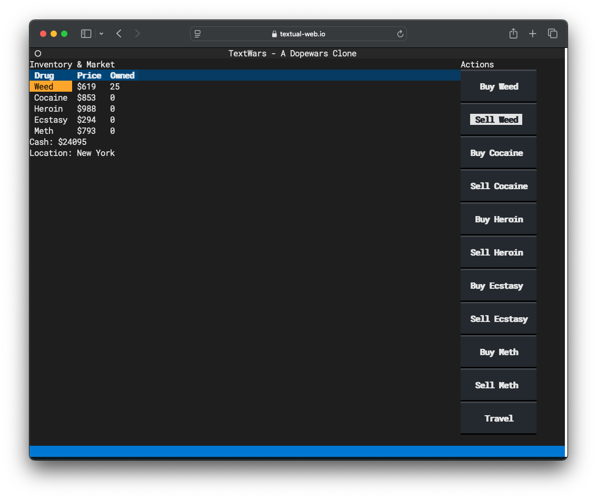

# textwars

Dopewars, [textualized](https://www.textualize.io/).

I asked an LLM: `Can you bang out a quick and dirty example of a Dopewars clone using Textual?`

This is what it produced.



## usage

```console
python3 -m pip install -r requirements.txt
textual-web --config serve.toml
```
